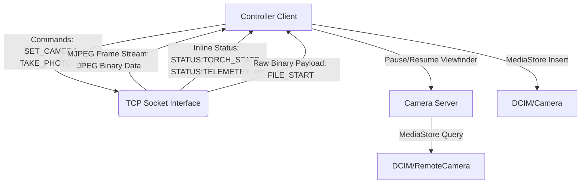

# Remote Camera (P2P Lens Monitor & Controller)

Remote Camera is a completely offline, zero-configuration P2P camera viewfinder, remote controller, and wireless media downloader. It allows one Android device to act as a **Camera Server** while another device acts as a **Controller**—communicating entirely over a local Wi-Fi Hotspot or shared local network with zero external internet dependencies.

---

## Intention & Core Concept

When shooting photos or recording high-quality videos using mounts, rigs, or tripods, it can be difficult or impossible to monitor the device's screen. 

This application bridges that gap:
* **Host Offline:** Works in the wilderness or studio over a local Wi-Fi hotspot.
* **Unified Pipeline:** Multiplexes live video, camera telemetry, control commands, and heavy binary file transfers over a single, robust TCP socket connection.
* **Camera Roll Sync:** Seamlessly downloads files remotely and drops them directly into the controller device's local camera roll gallery.

---

## Features

### 1. Remote Viewfinder & Controls
* **Full-Bleed Viewfinder:** Real-time live viewfinder streaming, fit to the screen width at its true aspect ratio (no stretching or cropping) using a custom shifting-window MJPEG parser, with controls overlaid directly on top of the feed.
* **Device Picker:** The Controller scans for Camera Servers via mDNS and lists everything it finds — each server broadcasts a friendly name (including device model) so you can tell multiple servers apart and choose exactly which one to pair with, instead of auto-connecting to whichever answers first.
* **Unified Shutter:** A single contextual shutter button with a Photo/Video mode switch — tap to capture a photo, or start/stop recording depending on mode — with haptic feedback and a shutter-flash animation on capture.
* **Viewfinder Rotation Calibration:** Cycle local rendering clockwise (`0° -> 90° -> 180° -> 270° -> 0°`) from the controller to adjust for upside-down, sideways, or physical camera rigs.
* **Dynamic Lens Switching:** Remotely cycle through available physical camera modules (e.g. Main lens, Ultra-Wide, Telephoto, Front camera).
* **Precise Zoom Slider:** Seamlessly adjust zoom ratio using presets (`0.5x`, `1.0x`, `2.0x`, `5.0x`) that dynamically filter themselves to the active lens's real capabilities — each physical lens's preset is derived from its focal length *and* sensor size, so lenses with a smaller sensor (e.g. a telephoto) report an accurate effective zoom rather than a raw, misleading focal-length ratio.

### 2. Device Telemetry & Flash Control
* **Battery & Charge Status:** View the server's battery percentage and charging status (with interactive indicator icons) in real time.
* **Storage Capacity Meter:** Display the server's free internal storage capacity (e.g. `24.5 GB free`) to prevent running out of space during recordings.
* **Remote Flash Control:** Toggle flash remotely — fires automatically at the moment of capture while in Photo mode, or functions as a continuous torch while a video is recording.

### 3. Wireless Offline Media Gallery
* **Bandwidth Optimization:** Entering the Gallery pauses viewfinder streaming (`PAUSE_STREAM`), allocating 100% of Wi-Fi bandwidth to media indexing and fast file downloads.
* **Media Indexing:** Reads all captured images/videos stored in `DCIM/RemoteCamera` on the server and lists them in a grid with formatted sizes and file types.
* **Direct Gallery Downloads:** Raw binary files are streamed directly over the TCP socket, intercepted by the client's parser, and saved using `MediaStore` to the controller's native gallery path (`DCIM/Camera`). Downloader displays real-time progress indicators.

---

## Technical Architecture



### Network Protocol
All messaging is multiplexed inside the MJPEG stream boundaries (`--frame` multipart frames):
1. **JPEG viewfinders:** Identifiable via standard JPEG start-of-image markers (`0xFF, 0xD8`).
2. **Text feedback:** Packaged as `--frame` plain text payload starting with `STATUS:`, handling battery telemetry, lens rotation, zoom bounds, and active camera indices.
3. **Binary file download:** Initiated by the server sending `FILE_START:<filename>:<fileSize>`. The client reads any leading bytes already pulled into the socket buffer, writes them, and then switches the parser to pull the exact remaining bytes directly from the stream before returning to normal viewfinder loop boundaries.

---

## Setup & How to Use

### Prerequisites
1. Two Android devices running **Android 10+ (API 29+)**.
2. No internet connection is needed.

### Steps:
1. **Configure Wi-Fi Hotspot:** Turn on the Wi-Fi hotspot on one device (A) and connect the second device (B) to it.
2. **Run Server (Device A):**
   * Open the app.
   * Tap **Camera Server**.
   * Toggle the server **ON**. It will start broadcasting its presence via mDNS.
3. **Run Controller (Device B):**
   * Open the app.
   * Tap **Controller**.
   * The app scans for Camera Servers via mDNS and lists everything it finds — tap the one you want to connect to.
4. **Use Controls:**
   * Adjust zoom, change lenses, or rotate the viewfinder to calibrate.
   * Switch between Photo/Video mode and use the shutter button to capture photos or start/stop recording.
   * Tap **Gallery** to download captured media remotely.

---

## Development & Compilation

To build and compile the application locally:

### Rebuild Debug APK
```bash
./gradlew assembleDebug
```
The compiled APK will be generated at `app/build/outputs/apk/debug/app-debug.apk`.

### Build Production (Release) APK
To compile a signed production (release) version:
```bash
./gradlew assembleRelease
```
The compiled release APK will be generated at `app/build/outputs/apk/release/app-release.apk`. It is automatically signed with the local debug signing key so you can install and test it directly on target devices.

### Run Unit Tests
```bash
./gradlew testDebugUnitTest
```
